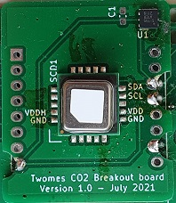
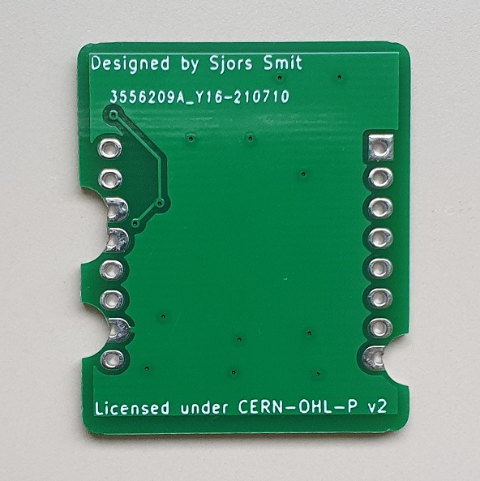

# Twomes CO₂ meter shield hardware 

This repository contains the open hardware design files for the Twomes CO₂ meter shield, which can measure CO₂ concentration, relative humidity and temperature.

 

## Table of contents
* [General info](#general-info)
* [Producing](#producing)
* [Developing](#developing) 
* [Features](#features)
* [Status](#status)
* [License](#license)
* [Credits](#credits)

## General info
This repository contains the hardware designs, such as schematics and board layout files for the Twomes CO₂ meter shield. It has the form factor of a [WeMos D1 Mini shield](https://www.wemos.cc/en/latest/d1_mini_shield/index.html). This allows it to be used in many ways, e.g.:
* on top of [Twomes Temperature Monitor Hardware](https://github.com/energietransitie/twomes-temp-monitor-hardware), running the [Twomes Room Monitor firmware](https://github.com/energietransitie/twomes-room-monitor-firmware);
* on top of a [LilyGO TTGO T7 Mini32 V1.3 ESP32](https://github.com/LilyGO/ESP32-MINI-32-V1.3), running fimrware yet to be written, based on [Twomes Generic firmware](https://github.com/energietransitie/twomes-generic-esp-firmware). 

## Producing

### Printed Circuit Board
To manufacture the printed circuit board you can use various PCB services. The folder [Output_files](./pcb/Output_files/FABRICATION) contains the files necessary. 

To have the PCBs manufactured via [JLCPCB](https://www.jlcpcb.com), the PCB manufacturer we used, upload the Gerber files in a zip to their [quote page](https://cart.jlcpcb.com/quote), select the amount of PCBs and a colour for silkscreen. All other options can be left on default. If SMT assembly is desired, also select this option before ordering. This will take you to a page where the BOM and POS file can be uploaded. Use the files [BOM_TwomesCO2-BreakoutJLCPCB.csv](./pcb/Output_files/FABRICATION/BOM_AND_POS/BOM_CO2-BreakoutJLCPCB.csv) and [TwomesCO2-Breakout-top-pos.csv](./pcb/Output_files/FABRICATION/BOM_AND_POS/TwomesCO2-Breakout-top-pos.csv).

## Developing
To change the hardware designs, you need:
* [KiCad](https://www.kicad.org/download/) installed to change te PCB design. 

Some EDA tools may be able to convert the files, however this is not supported and may result in errors.

To export the modified PCBs, consult the webpage of your PCB manufacturer of choice for guidance on how to produce the output files. For example,  see the [JLCPCB guide on how to export Gerbers](https://support.jlcpcb.com/article/149-how-to-generate-gerber-and-drill-files-in-kicad) and the  [JLCPCB guide how to export the BOM and POS files](https://support.jlcpcb.com/article/84-how-to-generate-the-bom-and-centroid-file-from-kicad)
## Features
The Twomes Twomes CO₂ meter shield features the follwoing main hardware components:
* Sensirion [SCD41](https://www.sensirion.com/en/environmental-sensors/carbon-dioxide-sensors/carbon-dioxide-sensor-scd4x/) sensor, which can measure CO₂ concentration, relative humidity and temperature;
* [Si7051](https://www.silabs.com/sensors/temperature/si705x/device.si7051) temperature sensor. 

To-do:
* add female connector for the [SEK-SCD41](https://www.sensirion.com/en/environmental-sensors/evaluation-kit-sek-environmental-sensing/evaluation-kit-sek-scd41/) evaluation kit;

## Status
Project is: _in progress_

## License
The hardware designs in this repository are available under the [CERN-OHL-P v2 license](./LICENSE), Copyright 2021 [Research group Energy Transition, Windesheim University of Applied Sciences](https://windesheim.nl/energietransitie)

## Credits
This open hardware design is a collaborative effort of:
* Sjors Smit · [@Shorts1999](https://github.com/Shorts1999)
* Marco Winkelman · [@MarcoW71](https://github.com/MarcoW71)

We use and gratefully acknowlegde the efforts of the makers of the following designs:
* [KiCad Libraries](https://kicad.github.io/), by the KiCad Development Team, licensed under [adapted version of the CC-BY-SA 4.0 License](https://www.kicad.org/libraries/license/)
